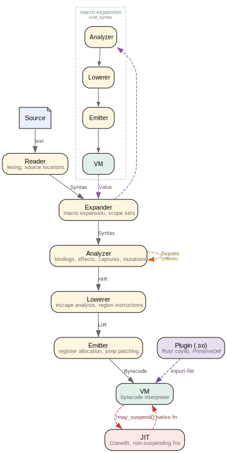

# Elle

Elle is a Lisp that compiles to bytecode and runs on a register-based VM
written in Rust. It takes heavy inspiration from
[Janet](https://janet-lang.org) — fibers as the universal control flow
primitive, signals over exceptions, masks over handler chains — and
extends the model with static effect inference, a Cranelift JIT, and
per-fiber heap isolation. The result is a dynamic language where the
compiler knows enough about your code to make the runtime fast without
annotations, without a garbage collector, and without coloring your
functions.

## Contents

- [Why Another Lisp](#why-another-lisp)
- [Colorless Concurrency](#colorless-concurrency)
- [Effects](#effects)
- [Fibers and Processes](#fibers-and-processes)
- [Memory](#memory)
- [FFI](#ffi)
- [Modules and Plugins](#modules-and-plugins)
- [JIT](#jit)
- [Macros](#macros)
- [Destructuring](#destructuring)
- [The Compilation Pipeline](#the-compilation-pipeline)
- [Getting Started](#getting-started)

## Why Another Lisp

Most languages carry decades of compatibility constraints. Elle has none.
The tradeoffs it makes are:

- **Lisp syntax** for uniform, machine-friendly structure. No parser
  ambiguity. Macros that operate on syntax trees, not text.
- **Rust host** for native performance and direct C interop without a
  garbage collector.
- **Inference over annotation.** Effects, captures, mutations, escape
  behavior, JIT eligibility — all inferred by the compiler. You write
  the logic; the compiler discovers the properties.

Elle is a scripting language that doesn't compromise on the parts that
matter: memory safety, FFI ergonomics, and knowing what your code does
before it runs.

## Colorless Concurrency

In most languages, a function that can suspend (async, yield, block) is
a different color from one that can't. You choose at definition time,
and the color propagates virally through every caller.

In Elle, functions are colorless. Any function can be run inside a fiber,
and the fiber decides what signals to catch — not the function. The
effect system infers which functions *might* suspend, but this is a
compile-time property used by the optimizer, not a constraint on the
programmer. You never write `async`. You never choose between sync and
async APIs. You write functions. The runtime handles the rest.

This follows Janet's insight: *functions are colorless, fibers are
colored.* The signal mask lives on the fiber, set at creation time by the
caller. A pure function and a yielding function have the same type, the
same calling convention, and the same syntax. The difference is only
visible to the compiler's effect analysis — and it uses that information
to optimize, not to restrict.

## Effects

Every expression in Elle carries an inferred effect: a compact
description of what it might do. The compiler computes this
automatically — no annotations, no declarations, no effect types in
your signatures.

A function that calls `yield` is inferred to suspend. A function that
only does arithmetic is inferred to be pure. A higher-order function
like `map` is inferred to be polymorphic over its callback — its effect
depends on what you pass it. This is all automatic.

This single mechanism replaces what other languages split across
async/await coloring, exception declarations, and capability
annotations. The compiler uses it to make three concrete decisions:

1. **JIT eligibility.** Functions that can't suspend get compiled to
   native x86_64 via Cranelift. Functions that might suspend stay
   interpreted — their frames need to be snapshot/restored, which native
   frames can't do. The programmer doesn't choose; the compiler
   decides based on what the code actually does.

2. **Scope-level memory reclamation.** When the compiler can prove a
   scope's allocations don't escape — no captures, no suspension, no
   outward mutation — it frees them automatically at scope exit. No
   manual memory management, no GC, just inference.

3. **Fiber heap routing.** When a yielding fiber passes values to its
   parent, those values must outlive the child's private heap. The
   runtime uses the inferred effect to route allocations to a shared
   arena — only for fibers that actually yield.

## Fibers and Processes

A fiber is an independent execution context: its own stack, its own call
frames, its own heap. Fibers communicate through yield/resume, and each
yield carries a signal — an integer that classifies the event. Signal
dispatch is a single bitmask check: O(1), branch-predictor-friendly.
`try`/`catch`, `protect`, and generators are all prelude macros built on
`fiber/new` and `resume`. One primitive; the language provides sugar.

This is the same idea as Erlang's process model, built on cooperative
scheduling. Each fiber runs until it yields, then the scheduler picks
the next one. Crash isolation comes from each fiber owning its own heap
— when a fiber dies, its entire heap is freed in O(1). Link-based
supervision comes from signal propagation through fiber chains.

The scheduler itself is user-level Elle code, not a runtime built-in.
`examples/processes.lisp` implements Erlang-style `spawn`, `send`,
`recv`, `link`, `trap-exit`, and `spawn-link` in under 200 lines,
including crash cascade and deadlock detection.

## Memory

Elle uses NaN-boxing: every value is 8 bytes. Integers, floats,
booleans, nil, symbols, keywords, and short strings (up to 6 bytes) fit
inline — no allocation. Everything else is a pointer into a heap.

There is no garbage collector. There is no stop-the-world pause. Memory
is managed through three mechanisms that work together:

**Per-fiber heaps.** Each fiber allocates into its own bump arena. When
a fiber finishes, its entire heap is freed in a single `reset()` — O(1)
regardless of how many objects it allocated. No traversal, no mark
phase, no sweep. This also gives fibers strong cache locality: a fiber's
working set is contiguous in memory, not scattered across a shared heap.

**Zero-copy inter-fiber sharing.** When a yielding fiber needs to pass
values to its parent, those allocations route to a shared arena that
both fibers can read. No deep copy, no serialization. The parent reads
the yielded value directly from shared memory. The compiler's effect
inference decides which fibers need this — pure fibers skip the overhead
entirely.

**Escape-analysis-driven scope reclamation.** The compiler analyzes
every `let`, `letrec`, and `block` scope. When it can prove that no
allocated value escapes — no captures, no suspension, no outward
mutation — it emits region instructions that free the scope's
allocations at exit. The allocator architecture supports custom
allocators at the scope level, allowing hot scopes to use dedicated
arenas tuned for their allocation patterns.

The combination means Elle reclaims memory deterministically, at scope
exit or fiber death, without pausing the world. Long-running fiber
schedulers don't accumulate garbage — each fiber's heap dies with it.

## FFI

Elle talks to C without ceremony. Load a library, bind a symbol, call
it:

```lisp
(def libc (ffi/native nil))
(ffi/defbind sqrt libc "sqrt" :double @[:double])
(sqrt 2.0)  # => 1.4142135623730951
```

Struct marshalling, variadic calls, callbacks (Elle functions as C
function pointers), and manual memory management all work:

```lisp
(def point-type (ffi/struct @[:double :double]))
(def p (ffi/malloc (ffi/size point-type)))
(ffi/write p point-type @[1.5 2.5])
(ffi/read p point-type)  # => @[1.5 2.5]
(ffi/free p)
```

FFI calls are tagged in the effect system so the compiler knows where
Elle's safety guarantees end and C's begin.

## Modules and Plugins

Elle's module system is minimal by design. `import-file` loads a file —
Elle source or a native `.so` plugin — compiles and executes it, and
returns the last expression's value. There is no module declaration
syntax, no export list, no special import form. It's a function call.

**Source modules** return their last expression. A module that defines
functions via `def` makes them available as globals; a module that ends
with a struct or a function hands that value back to the caller:

```lisp
# math.lisp — parametric module
(fn (precision)
  {:add (fn (a b) (round (+ a b) precision))
   :mul (fn (a b) (round (* a b) precision))})
```

```lisp
(def {:add add :mul mul} ((import-file "math.lisp") 3))
(add 1.1111 2.2222)  # => 3.333
```

The caller destructures whichever symbols it wants. The module decides
what to expose by choosing what to return.

**Native plugins** are Rust cdylib crates that link against `elle` and
export an init function. Plugins register primitives through the same
`PrimitiveDef` mechanism as builtins — same effect declarations, same
doc strings, same arity checking — and work directly with `Value`. No C
marshalling, no serialization boundary:

```lisp
(def re (import-file "target/release/libelle_regex.so"))
(def pat (re:compile "\\d+"))
(re:find-all pat "a1b2c3")  # => ({:match "1" ...} {:match "2" ...} ...)
```

Nine plugins ship with Elle: regex, sqlite, crypto, random, mermaid,
selkie, sugiyama, fdg, and dagre.

Because `import-file` is an ordinary primitive, the module system is
user-replaceable. You can wrap it with caching, path resolution, or
sandboxing. You can shadow it entirely. The language doesn't care how
modules get loaded — it only cares about the value that comes back.

## JIT

The JIT compiles non-suspending functions to native x86_64 via
Cranelift. The compiler's effect inference decides what qualifies —
there is no annotation. If a function might yield or suspend, it stays
interpreted. Everything else — arithmetic, data structures, recursion,
FFI — is a JIT candidate.

Self-tail-calls become native loops: the JIT detects self-recursion in
tail position and emits a jump instead of a call. Mutually recursive
groups are discovered and compiled as a batch, with direct native calls
between peers. Integer arithmetic gets inline fast paths — a type-tag
check, then native machine operations, with a fallback for mixed types.

## Macros

Elle's macros are hygienic. The expander uses scope sets (Racket-style)
to prevent accidental name capture. A macro that introduces a `tmp`
binding won't shadow the caller's `tmp`:

```lisp
(defmacro my-swap (a b)
  `(let ((tmp ,a)) (set ,a ,b) (set ,b tmp)))

(let ([tmp 100] [x 1] [y 2])
  (my-swap x y)
  tmp)  # => 100, not 1
```

When you want intentional capture — anaphoric macros, DSLs —
`datum->syntax` is the escape hatch.

`defn`, `let*`, `->`, `->>`, `when`, `unless`, `try`/`catch`,
`protect`, `defer`, `with`, and `yield*` are all prelude macros. The
prelude is plain Elle loaded by the expander before user code — no
special-form machinery, just the same expansion available to user macros.

## Destructuring

Destructuring works everywhere bindings appear: `def`, `let`, `let*`,
`var`, `fn` parameters, `match` patterns.

```lisp
(def (head & tail) (list 1 2 3 4))              # list rest
(def [x _ z] [10 20 30])                        # tuple with wildcard
(def {:name n :age a} {:name "Bob" :age 25})     # struct by key
(def {:config {:db {:host h}}}                   # nested, three levels
  {:config {:db {:host "localhost"}}})
```

Missing values become `nil` — no runtime error. Wrong types become
`nil`. This is silent nil semantics, separate from `match` which is
conditional and type-guarded.

## The Compilation Pipeline



Source locations survive the full journey for error reporting. Each stage
infers more than the last: the reader produces syntax objects with scope
sets; the analyzer resolves bindings, infers effects, computes captures,
and flags mutations; the lowerer runs escape analysis and emits
scope-level memory reclamation; the JIT uses all of this to decide what
to compile natively.

The pipeline has three non-linear paths. The analyzer loops until
inter-procedural effects converge (fixpoint iteration over mutually
recursive top-level defines). The expander re-enters the pipeline
recursively to evaluate macro bodies. And the JIT forks off the VM to
compile non-suspending closures to native x86_64 after bytecode
execution.

Nothing is annotated. Everything is inferred.

## Getting Started

```bash
make                                          # build elle + plugins + docs
./target/release/elle examples/hello.lisp     # run a file
./target/release/elle                         # REPL
./target/release/elle --lint file.lisp        # static analysis
./target/release/elle --lsp                   # language server
```

The `examples/` directory is executable documentation. Each file
demonstrates a feature and asserts its own correctness — they run as
part of CI.

## License

MIT
