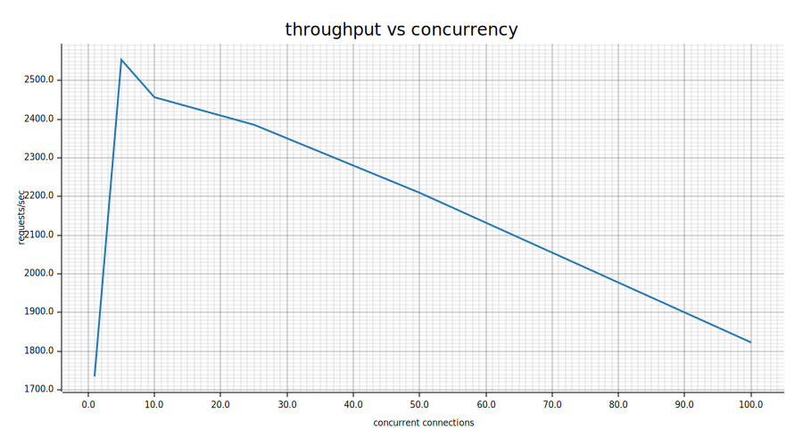
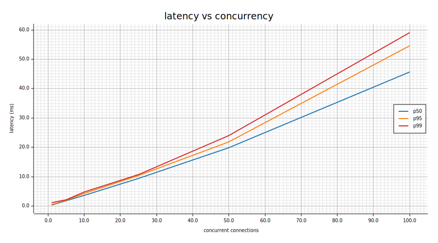
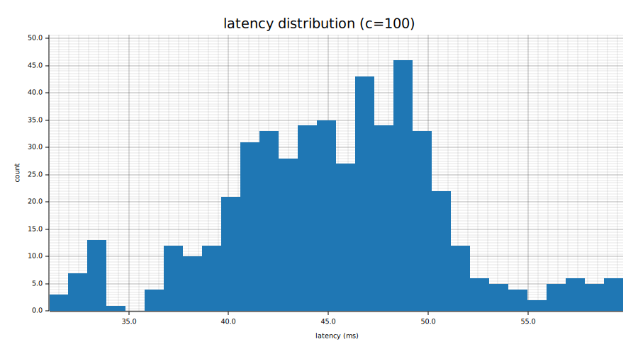

# Web Server + Load Generator

A demo HTTP server and concurrent load generator written in Elle.

## Quick start

```bash
# Start the server (default port 8080)
elle demos/webserver/server.lisp

# In another terminal, run the load generator
elle demos/webserver/loadgen.lisp http://127.0.0.1:8080/ 1000 50
```

## Server

`server.lisp` is a multi-endpoint HTTP server built on `std/http`:

| Endpoint | Method | Description |
|----------|--------|-------------|
| `/` | GET | Welcome page |
| `/health` | GET | JSON health check |
| `/echo` | POST | Echoes the request body |
| `/delay/:ms` | GET | Responds after sleeping for `:ms` milliseconds |
| `/counter` | GET | Returns an incrementing hit counter |
| `/stats` | GET | JSON with server uptime and total request count |

The port defaults to 8080 and can be overridden via CLI argument:

```bash
elle demos/webserver/server.lisp 9090
```

## Load generator

`loadgen.lisp` fires concurrent HTTP requests and reports latency
statistics. Two modes:

- **fresh** (default) — new TCP connection per request; realistic baseline
- **keepalive** — persistent connections reused across requests

```bash
elle demos/webserver/loadgen.lisp [url] [requests] [concurrency] [keepalive]
```

| # | Parameter | Default |
|---|-----------|---------|
| 1 | Target URL | `http://127.0.0.1:8080/` |
| 2 | Total requests | 1000 |
| 3 | Concurrency | 50 |
| 4 | `keepalive` (literal) | fresh connections |

## Benchmarking

`bench.lisp` sweeps concurrency levels and generates SVG charts via
the `plugin/plotters` plugin:

```bash
elle demos/webserver/bench.lisp http://127.0.0.1:8080/
```

Produces three charts:

### Throughput vs concurrency



Peak throughput is ~3450 req/s at c=5, sustaining >3100 req/s through
c=50 before dropping to ~2560 at c=100 as scheduler contention grows.

### Latency percentiles vs concurrency



p50/p95/p99 scale roughly linearly with concurrency. At c=1, p50 is
0.3ms; at c=100, p50 is 32ms. The tight spread between percentiles
means tail latency tracks the median — no outlier storms.

### Latency distribution at peak concurrency



Bell curve centered around 32ms at c=100, with a tail to ~49ms.

## JIT compilation

JIT compilation runs on a background thread. When a function becomes
hot (called 10+ times by default), its LIR is sent to a worker thread
for Cranelift compilation. The interpreter continues running the
function while native code is generated. When compilation finishes,
the next call picks up the compiled code from cache. This eliminates
the ~17ms event-loop stall that synchronous Cranelift compilation
caused on keepalive connections.

## Features demonstrated

- `std/http` server and client
- `ev/map-limited` for bounded concurrency
- `ev/sleep` for async delays
- `clock/monotonic` for high-resolution timing
- `json/serialize` for JSON responses
- `protect` for error capture without propagation
- `plugin/plotters` for SVG chart generation
