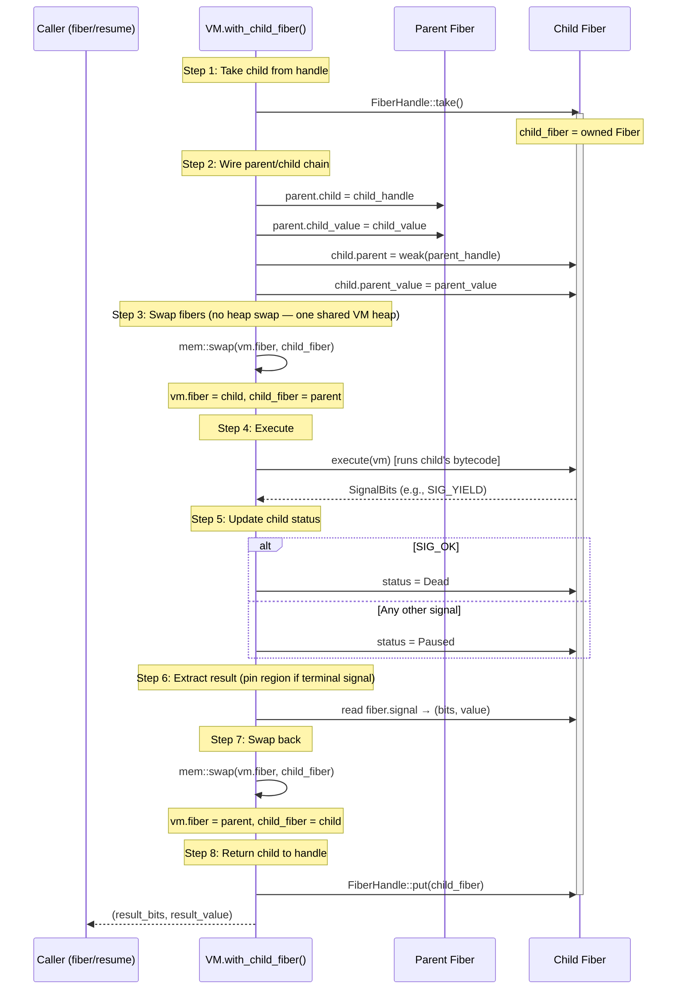

# Fiber Primitives

User-facing fiber operations and patterns.

## Fiber Primitives


| Primitive | Signature | Purpose |
|-----------|-----------|---------|
| `fiber/new` | `(fn mask) → fiber` | Create fiber from closure with signal mask |
| `fiber/resume` | `(fiber value) → value` | Resume fiber, delivering a value# returns signal value |
| `emit` | `(bits value) → (suspends)` | Emit signal from current fiber |
| `fiber/status` | `(fiber) → keyword` | `:new`, `:alive`, `:suspended`, `:dead`, `:error` |
| `fiber/value` | `(fiber) → value` | Signal payload or return value |
| `fiber/bits` | `(fiber) → int` | Signal bits from last signal |
| `fiber/mask` | `(fiber) → int` | Capability mask |
| `fiber/parent` | `(fiber) → fiber\|nil` | Parent fiber |
| `fiber/child` | `(fiber) → fiber\|nil` | Most recently resumed child |
| `fiber/propagate` | `(fiber) → (propagates)` | Propagate caught signal, preserve chain |
| `fiber/cancel` | `(fiber value?) → value` | Hard-kill: set to :error, no unwinding |
| `fiber/abort` | `(fiber value?) → value` | Graceful: inject error, resume for unwinding |
| `fiber?` | `(value) → bool` | Type predicate |

Primitives that need VM-side execution (`fiber/resume`) signal the VM
to perform the context switch.


## Generators


A generator is a fiber whose closure yields values:

```text
(def gen (fiber/new (fn () (yield 1) (yield 2) (yield 3)) |:yield|))
(fiber/resume gen nil)  # → SIG_YIELD, (fiber/value gen) → 1
(fiber/resume gen nil)  # → SIG_YIELD, (fiber/value gen) → 2
(fiber/resume gen nil)  # → SIG_YIELD, (fiber/value gen) → 3
(fiber/resume gen nil)  # → SIG_OK, (fiber/value gen) → nil
```

The generator pattern — a fiber whose closure yields values — is the
basis of Elle's stream and generator abstractions.


## Error Handling


Errors are values: `{:error :keyword :message "message"}` structs.
`error_val(kind, msg)` constructs them; `format_error(value)` extracts
human-readable text.

There is no `Condition` type, no exception hierarchy, no `handler-case`.
Error handling is signal handling:

1. Code signals `SIG_ERROR` with an error struct
2. Signal propagates up the fiber chain
3. A fiber with `SIG_ERROR` in its mask catches it
4. The handler inspects `fiber/value` and decides: handle, resume, or
   propagate further

**Errors are not implicitly unwinding.** An errored fiber remains suspended
(not dead). A parent that catches an error can resume the errored fiber,
delivering a recovery value — this enables restart-style error handling.
Uncaught errors crash the runtime; no `ev/join` is needed for error
propagation.

`try`/`catch` is a prelude macro that wraps this pattern (`src/prelude.lisp`).


## Terminal vs. Resumable Signals


Whether a signal is terminal or resumable is a **handler decision**, not a
signal property. Any signal leaves the child in `Suspended` status. The
handler either:

- **Resumes** the child (delivering a value) → resumable
- **Doesn't resume** (lets it be GC'd) → terminal

An uncaught `SIG_ERROR` at the root fiber is terminal by convention.

**Exception:** `SIG_TERMINAL` signals are uncatchable. They pass through
mask checks regardless of the fiber's mask. This is how `fiber/cancel`
self-cancel works — the terminal signal cannot be caught by `protect` or
`defer`, ensuring the fiber dies immediately.


## Cancel vs. Abort


Two distinct operations for ending a fiber's execution:

### fiber/cancel — hard kill

Sets the fiber to `:error` status immediately. No VM dispatch, no
frame execution, no defer/protect unwinding. The fiber is dead.

- Accepts `:new` or `:paused` fibers (other-cancel)
- Accepts `:alive` fibers (self-cancel only — the currently running fiber)
- Self-cancel returns `SIG_ERROR | SIG_TERMINAL`, which terminates the
  dispatch loop without unwinding. The terminal signal is uncatchable —
  it propagates through all masks including `protect` and `defer`
- Other-cancel returns `SIG_OK` with the error value

```text
(def f (fiber/new (fn [] (defer (print :cleanup) (yield) :done)) |:error :yield|))
(fiber/resume f)          # f is now :paused
(fiber/cancel f :reason)  # f is now :error, :cleanup never printed
```

### fiber/abort — graceful termination

Injects an error into a `:paused` fiber and resumes it. The fiber's
error handlers (`protect`) and cleanup blocks (`defer`) execute during
unwinding. The result is handled identically to `fiber/resume` — the
child's actual outcome determines what the parent sees.

- Only accepts `:paused` fibers
- Returns `SIG_ABORT` — the VM handles the fiber swap
- No post-hoc status stomp: if the fiber's protect catches and recovers,
  the fiber may end up `:dead` instead of `:error`

```text
(def f (fiber/new (fn [] (defer (print :cleanup) (yield) :done)) |:error :yield|))
(fiber/resume f)          # f is now :paused
(fiber/abort f :reason)   # :cleanup printed, f is now :error
```

### Aliases

`cancel` is an alias for `fiber/cancel`. `abort` is an alias for `fiber/abort`.


## Fiber Swap Protocol


`VM::with_child_fiber()` is the single entry point for switching execution from
a parent fiber to a child fiber. It owns the full lifecycle of a fiber resume:
wiring the parent/child chain, swapping the active fiber, executing the child's
bytecode, and restoring everything before returning the result to the caller.
All `fiber/resume` calls go through this function.

There is one heap per VM, and every fiber — root and children alike — shares
it. Switching fibers is therefore just a stack/active-fiber swap; the heap
pointer never moves. A value a child allocates and yields lives in its own
region with RC > 0 and outlives the child without any copy; the parent reads a
16-byte `Value` into that same heap.



### Swap protocol invariants

**One heap, no heap swap.** All fibers share the VM's single heap, so the swap
is a pure active-fiber switch (step 3). There is no per-fiber heap pointer to
save or restore.

**A terminal result's region is pinned.** A fiber that returns, errors, or
halts holds its result in `signal`, read later via `fiber/value` after control
has left it. Before swap-back, the result's region is incref'd (step 6) so the
parent's `DecrefValueRegion` on the resume result cannot free it out from under
the fiber; the matching release happens when the fiber itself is freed.
Suspending signals (yield, I/O) are excluded — their value is consumed
transiently and the fiber runs again, so the normal value flow governs it.

**Child fiber is always returned to its handle.** Step 8 runs unconditionally,
including on error paths. A fiber that was taken from its handle at step 1 is
always put back. Callers can always re-resume a paused fiber or inspect a dead
one; the handle is never left empty by a failed resume.

Source: `src/vm/fiber/child.rs`


## What's Not Implemented Yet


| Feature | Status |
|---------|--------|
| `fiber/closure`, `fiber/stack`, `fiber/env` | Not started |
| Dynamic bindings (`dyn`/`setdyn`) | `env` field exists, no primitives |


---

## See also

- [Signal index](index.md)
- [Fiber architecture](fibers.md)
