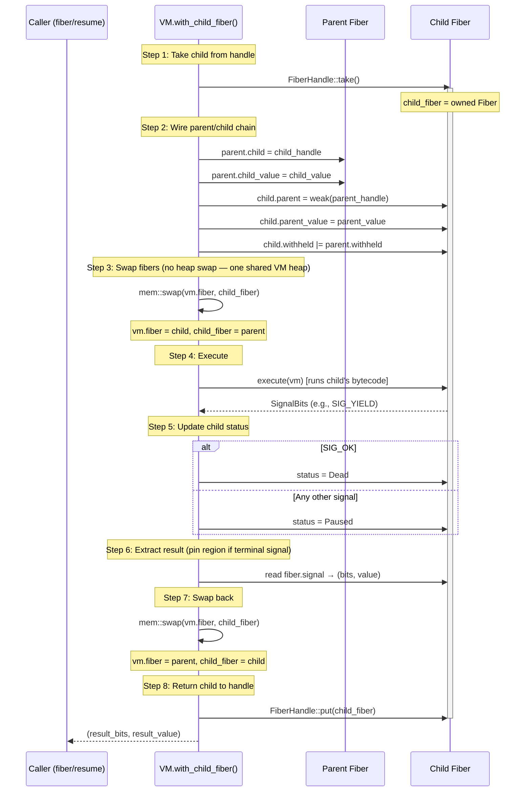

# Fiber Primitives

<!-- audited: 2026-09-29 -->

User-facing fiber operations and patterns.

## Fiber Primitives

| Primitive | Signature | Purpose |
|-----------|-----------|---------|
| `fiber/new` (`fiber`) | `(fn mask :deny bits?) → fiber` | Create a fiber from a closure with a signal mask; `:deny` withholds capabilities |
| `fiber/resume` (`resume`) | `(fiber value?) → value` | Resume a fiber, delivering a value; answers the payload it stops on |
| `emit` | `(signal value?) → (suspends)` | Emit a signal from the current fiber ([emit.md](emit.md)) |
| `fiber/status` | `(fiber) → keyword` | `:new`, `:alive`, `:paused`, `:dead`, `:error` |
| `fiber/value` | `(fiber) → value` | Signal payload or return value |
| `fiber/bits` | `(fiber) → int` | Signal bits from the last signal; 0 after a return |
| `fiber/mask` | `(fiber) → int` | Signal mask |
| `fiber/caps` | `(fiber?) → set` | Capabilities the fiber, or the current one, still holds |
| `fiber/parent` | `(fiber) → fiber\|nil` | Parent fiber |
| `fiber/child` | `(fiber) → fiber\|nil` | Most recently resumed child |
| `fiber/propagate` | `(fiber) → (propagates)` | Propagate caught signal, preserve chain |
| `fiber/cancel` (`cancel`) | `(fiber value?) → value` | End a fiber for good: it goes `:dead`, and no code in it runs |
| `fiber/abort` (`abort`) | `(fiber value?) → value` | Raise an error at a paused fiber's suspension point; it stops `:error` and stays resumable |
| `fiber/refuse` | `(fiber value?) → value` | Refuse a paused fiber's call: raise at its call site, fiber lives on |
| `fiber/set-fuel`, `fiber/fuel`, `fiber/clear-fuel` | `(fiber n)`, `(fiber)`, `(fiber)` | Set, read, and remove the instruction budget |
| `fiber/error?`, `fiber/done?` | `(fiber) → bool` | `:error`; `:dead` or `:error` |
| `fiber/denied?` | `(fiber) → bool` | Paused on a capability denial ([capabilities.md](capabilities.md)) |
| `fiber?` | `(value) → bool` | Type predicate |

Primitives that need VM-side execution (`fiber/resume`) signal the VM
to perform the context switch.

## Generators

A generator is a fiber whose closure yields values:

```lisp
(def gen (fiber/new (fn [] (yield 1) (yield 2) (yield 3)) |:yield|))
(assert (= (fiber/resume gen) 1))       # each resume answers the next yield
(assert (= (fiber/bits gen) 2))         # SIG_YIELD
(assert (= (fiber/resume gen) 2))
(assert (= (fiber/resume gen) 3))
(assert (nil? (fiber/resume gen)))      # the body returns its last resume value
(assert (= (fiber/status gen) :dead))
(assert (= (fiber/bits gen) 0))         # a return carries no signal bits
```

The generator pattern — a fiber whose closure yields values — is the
basis of Elle's stream and generator abstractions.

## Error Handling

Errors are values: `{:error :keyword :message "message"}` structs. A
primitive builds one with `ctx.error(kind, msg)`, and `format_error(value)`
in [src/value/error.rs](../../src/value/error.rs) renders one as text.

There is no `Condition` type, no exception hierarchy, no `handler-case`.
Error handling is signal handling:

1. Code signals `SIG_ERROR` with an error struct
2. Signal propagates up the fiber chain
3. A fiber with `SIG_ERROR` in its mask catches it
4. The handler inspects `fiber/value` and decides: handle, resume, or
   propagate further

**Errors are not implicitly unwinding.** A child whose mask catches
`:error` stops `:paused` at the call that raised it. The parent can resume
it with a recovery value, which becomes that call's result — restart-style
error handling. A child whose mask does not catch `:error` stops `:error`,
and the error continues past the parent's `fiber/resume` to the next fiber
up. That child restarts the same way. An error that no fiber catches ends
the program.

```lisp
(def restartable
  (fiber/new (fn [] (+ 1 (error {:error :oops :message "retry"}))) |:error|))
(fiber/resume restartable)
(assert (= (fiber/status restartable) :paused))
(assert (= (fiber/resume restartable 41) 42))   # the recovery value is error's result

(def failing (fiber/new (fn [] (error {:error :oops :message "no handler"})) |:yield|))
(let [[ok? err] (protect (fiber/resume failing))]
  (assert (not ok?))                             # the error passed the resume
  (assert (= (get err :error) :oops)))
(assert (= (fiber/status failing) :error))
```

So a fiber stopped on a caught error answers `:paused` — the same keyword
as a fiber waiting to resume — and only `SIG_ERROR` in `fiber/bits` tells
the two apart. That makes "is this fiber finished?" a question about intent
rather than state, and it has two different answers:

- **A resumer** decides. `fiber/error?` and `fiber/done?` read the status
  alone, so both answer false for a paused fiber holding an error, which you
  may still resume with a recovery value.
- **A scheduler** already decided, when it routed the fiber to completion.
  It records that in its own completion map, so it reads that map rather
  than re-deriving from a status that cannot distinguish the two cases. A
  status test there reads a failed program as still running, and then waits
  for it against orphans that can never finish on their own.

[tests/elle/ev-run-error-teardown.lisp](../../tests/elle/ev-run-error-teardown.lisp)
pins the distinction and the wait.

`try`/`catch` is a prelude macro that wraps this pattern
([src/prelude.lisp](../../src/prelude.lisp)).

### Where a restart lands

A restart answers the call that raised. The recovery value takes the place
of that call's result, whether the call is `error`, a primitive or an
instruction, and the rest of the expression runs on it:

```lisp
(def lookup (fiber/new (fn [] (+ 1 (get nil :x))) |:error|))
(assert (= (get (fiber/resume lookup) :error) :type-error))
(assert (= (fiber/resume lookup 41) 42))        # 41 stands in for the get
```

A raise in a function the body calls lands the same way, and the frames
above it run on. That holds for a callee that has suspended once before it
raises:

```lisp
(defn after-yield [] (yield 1) (+ 100 (error :boom)))
(def nested (fiber/new (fn [] (list :got (after-yield))) |:yield :error|))
(assert (= (fiber/resume nested) 1))
(assert (= (fiber/resume nested) :boom))
(assert (= (fiber/resume nested 41) (list :got 141)))
```

A raise in a callee on the fiber's first run is the exception. The callee's
frames are gone by the time the fiber stops, so the restart answers the
body's call to that callee instead
([#1289](https://github.com/elle-lisp/elle/issues/1289)):

```lisp
(defn first-run [] (+ 100 (error :boom)))
(def early (fiber/new (fn [] (list :got (first-run))) |:error|))
(fiber/resume early)
(assert (= (fiber/resume early 41) (list :got 41)))   # the call to first-run answers
```

An `:error` fiber restarts at the raising call too. When a child's error
passes its parent, the parent stops at its own `fiber/resume` call, and a
restart of the parent answers that call.

```lisp
(def escaped (fiber/new (fn [] (list :got (+ 1 (get nil :x)))) |:yield|))
(assert (not (first (protect (fiber/resume escaped)))))
(assert (= (fiber/status escaped) :error))
(assert (= (fiber/resume escaped 41) (list :got 42)))
```

A raise with no result has nothing to answer. A `silence` bound on a
parameter, a `parameterize` of a value that is not a parameter, and the
object limit (`arena/set-object-limit`) each raise where no call result is
waiting. A restart continues after the raise, and the recovery value goes
nowhere. A `parameterize` that raised binds nothing, so its body runs with
the bindings around it:

```lisp
(def depth (make-parameter 0))
(def not-a-parameter 42)
(def unbound
  (fiber/new (fn []
               (parameterize ((depth 5))
                 (list :a (parameterize ((not-a-parameter 1)) :x) (depth))))
             |:error|))
(assert (= (get (fiber/resume unbound) :error) :type-error))
(assert (= (fiber/resume unbound :ignored) (list :a :x 5)))
```

## Terminal vs. Resumable Signals

Whether a caught signal is terminal or resumable is a **handler decision**,
not a signal property. Any signal the parent catches leaves the child in
`Paused` status. The handler either:

- **Resumes** the child (delivering a value) → resumable
- **Doesn't resume** it, and the child is freed with its region → terminal

An uncaught `SIG_ERROR` at the root fiber is terminal by convention.

**Exception:** `SIG_TERMINAL` signals are uncatchable. They pass through
mask checks regardless of the fiber's mask. This is how `fiber/cancel`
self-cancel works — the terminal signal cannot be caught by `protect` or
`defer`, ensuring the fiber dies immediately.

## Cancel vs. Abort

`fiber/cancel` ends a fiber for good. `fiber/abort` raises an error in the
fiber and leaves the parent free to resume it.

### fiber/cancel — end a fiber

Sets the fiber to `:dead` at once. No frame of the fiber runs, so no
`defer` or `protect` in it sees the cancel, and it can never be resumed.
`fiber/value` holds the cancel value and `fiber/bits` holds `SIG_ERROR`,
which is how a reader tells a cancel from a return.

- Accepts a `:new`, `:paused` or `:error` fiber (other-cancel), and
  answers the cancel value
- Accepts an `:alive` fiber only as self-cancel, the currently running
  fiber
- Self-cancel returns `SIG_ERROR | SIG_TERMINAL`, which ends the dispatch
  loop at once. The terminal signal passes every mask, including the ones
  `protect` and `defer` set
- A `:dead` fiber raises a `:state-error`

```lisp
(def cleanups @[])
(def cancelled
  (fiber/new (fn [] (defer (push cleanups :cancelled) (yield) :done)) |:error :yield|))
(fiber/resume cancelled)
(assert (= (fiber/status cancelled) :paused))
(assert (= (fiber/cancel cancelled :reason) :reason))
(assert (= (fiber/status cancelled) :dead))
(assert (= (fiber/value cancelled) :reason))
(assert (= (fiber/bits cancelled) 1))            # SIG_ERROR: a cancel, not a return
(assert (empty? cleanups))                       # the defer never ran
(assert (not (first (protect (fiber/resume cancelled)))))   # it never runs again

(def stopped (fiber/new (fn [] (error :boom)) |:yield|))
(protect (fiber/resume stopped))
(assert (= (fiber/status stopped) :error))
(fiber/cancel stopped :gone)
(assert (= (fiber/status stopped) :dead))
```

### fiber/abort — raise at the suspension point

Raises an error at a `:paused` fiber's suspension point, as though the call
the fiber waits on had raised it. The fiber's own `protect` and `defer` see
the error there, as they see any raise at that call. Where nothing in the
fiber catches it, the fiber stops `:error` at that call. The parent may
resume it, and the resume value answers the call.

- A `:paused` fiber takes the error. The abort answers what the fiber stops
  on: the abort value where nothing in the fiber catches it
- A `:new` fiber has no suspension point, so it ends `:error` holding the
  value and never runs
- A `:dead` fiber is left alone, and the call answers its final value
- An `:alive` or `:error` fiber raises a `:state-error`
- The fiber's status is whatever its code makes of the error: a `protect`
  that catches it and runs on can leave the fiber `:dead` or `:paused`
- Where the fiber's mask does not catch `:error`, the error continues past
  the `fiber/abort` call, as it would past `fiber/resume`

```lisp
(def aborted
  (fiber/new (fn [] (defer (push cleanups :aborted) (yield) :done)) |:error :yield|))
(fiber/resume aborted)
(assert (= (fiber/abort aborted :reason) :reason))
(assert (= (fiber/status aborted) :error))
(assert (= cleanups @[:aborted]))                # the defer ran

(def resumable (fiber/new (fn [] (list :got (+ 100 (yield 1)))) |:error :yield|))
(fiber/resume resumable)
(assert (= (fiber/abort resumable :stop) :stop))
(assert (= (fiber/status resumable) :error))
(assert (= (fiber/resume resumable 5) (list :got 105)))   # 5 answers the yield

(def finished (fiber/new (fn [] 7) |:error|))
(fiber/resume finished)
(assert (= (fiber/abort finished :reason) 7))    # a dead fiber answers its value
```

#### Handlers that suspend

The handlers an abort reaches are ordinary code, so they can suspend: a
`defer` cleanup that writes to a port emits `:io`, and so does a `protect`
body that continues into an I/O call after it captures the error. The
abort then returns that signal, and the fiber stays `:paused` with the
request in `fiber/value` — the same result `fiber/resume` gives for the
same call. The next resume continues the handler from where it stopped.

The rule holds at every depth. A fiber parked at `(fiber/resume child)`
runs its own continuation only after the child's handler finishes, so a
`defer` inside a `defer` still runs the inner body before the outer
cleanup. [tests/elle/unwind-suspend.lisp](../../tests/elle/unwind-suspend.lisp) pins the four shapes —
`protect`, `try`, `defer`, and one `defer` inside another.

### Aliases

`cancel` is an alias for `fiber/cancel`. `abort` is an alias for `fiber/abort`.

## Fiber Swap Protocol

`VM::with_child_fiber()` is the single entry point for switching execution from
a parent fiber to a child fiber. It owns the full lifecycle of a fiber resume:
wiring the parent/child chain, swapping the active fiber, executing the child's
bytecode, and restoring everything before returning the result to the caller.
All `fiber/resume` calls go through this function.

There is one heap per VM, and every fiber — root and children alike — shares
it. Switching fibers is therefore just a stack/active-fiber swap; the heap
pointer never moves. A value a child allocates and yields lives in its own
region with RC > 0 and outlives the child without any copy; the parent reads a
16-byte `Value` into that same heap.


```mermaid
sequenceDiagram
    participant Caller as Caller (fiber/resume)
    participant VM as VM.with_child_fiber()
    participant Parent as Parent Fiber
    participant Child as Child Fiber

    Note over VM: Step 1: Take child from handle
    VM->>Child: FiberHandle::take()
    activate Child
    Note over Child: child_fiber = owned Fiber

    Note over VM: Step 2: Wire parent/child chain
    VM->>Parent: parent.child = child_handle
    VM->>Parent: parent.child_value = child_value
    VM->>Child: child.parent = weak(parent_handle)
    VM->>Child: child.parent_value = parent_value
    VM->>Child: child.withheld |= parent.withheld

    Note over VM: Step 3: Swap fibers (no heap swap — one shared VM heap)
    VM->>VM: mem::swap(vm.fiber, child_fiber)
    Note over VM: vm.fiber = child, child_fiber = parent

    Note over VM: Step 4: Execute
    VM->>Child: execute(vm) [runs child's bytecode]
    Child-->>VM: SignalBits (e.g., SIG_YIELD)

    Note over VM: Step 5: Update child status
    alt SIG_OK
        VM->>Child: status = Dead
    else Any other signal
        VM->>Child: status = Paused
    end

    Note over VM: Step 6: Extract result (pin region if terminal signal)
    VM->>Child: read fiber.signal → (bits, value)

    Note over VM: Step 7: Swap back
    VM->>VM: mem::swap(vm.fiber, child_fiber)
    Note over VM: vm.fiber = parent, child_fiber = child

    Note over VM: Step 8: Return child to handle
    VM->>Child: FiberHandle::put(child_fiber)
    deactivate Child

    VM-->>Caller: (result_bits, result_value)
```

Step 5 is provisional for an error. The resume handler that called
`with_child_fiber` promotes a `SIG_ERROR` outside the child's mask
to `Error`, the status `failing` shows under Error Handling.

### Swap protocol invariants

**One heap, no heap swap.** All fibers share the VM's single heap, so the swap
is a pure active-fiber switch (step 3). There is no per-fiber heap pointer to
save or restore.

**A terminal result's region is pinned.** A fiber that returns, errors, or
halts holds its result in `signal`, read later via `fiber/value` after control
has left it. Before swap-back, the result's region is incref'd (step 6) so the
parent's `DecrefValueRegion` on the resume result cannot free it out from under
the fiber; the matching release happens when the fiber itself is freed.
Suspending signals (yield, I/O) are excluded — their value is consumed
transiently and the fiber runs again, so the normal value flow governs it.

**Child fiber is always returned to its handle.** Step 8 runs unconditionally,
including on error paths. A fiber that was taken from its handle at step 1 is
always put back. Callers can always re-resume a paused fiber or inspect a dead
one; the handle is never left empty by a failed resume.

Source: [src/vm/fiber/child.rs](../../src/vm/fiber/child.rs)

## What's Not Implemented Yet

| Feature | Status |
|---------|--------|
| `fiber/closure`, `fiber/stack`, `fiber/env` | Not started |

Dynamic bindings are parameters, which a fiber snapshots from its creator
([parameters.md](../parameters.md)).

---

## See also

- [Signal index](index.md)
- [Fiber architecture](fibers.md)
